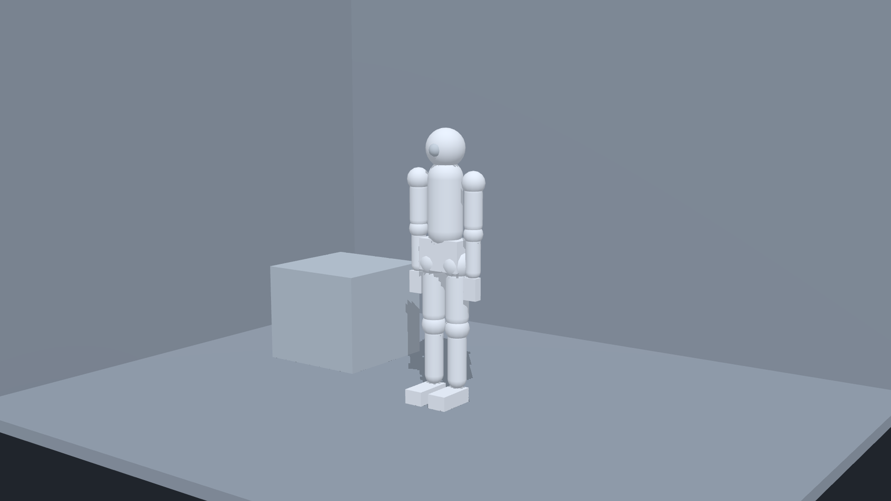

# Shubi Shot Director / 休比镜头导演

Shubi Shot Director is a local, browser-based 3D graybox camera-previsualization tool driven by a Codex Skill.

## Launch Demo

[](https://github.com/maoxiansheng0323-a11y/shubi-shot-director/releases/download/v0.2.1/shubi-shot-director-launch-demo.mp4)

**[Watch the 49-second launch demo](https://github.com/maoxiansheng0323-a11y/shubi-shot-director/releases/download/v0.2.1/shubi-shot-director-launch-demo.mp4)** · [Exported PNG](https://github.com/maoxiansheng0323-a11y/shubi-shot-director/releases/download/v0.2.1/final-perspective.png) · [English subtitles](https://github.com/maoxiansheng0323-a11y/shubi-shot-director/releases/download/v0.2.1/captions.en.srt) · [中文字幕](https://github.com/maoxiansheng0323-a11y/shubi-shot-director/releases/download/v0.2.1/captions.zh-CN.srt)

Current release: [v0.4.0 release notes](docs/releases/v0.4.0.md).

Shubi Shot Director is open-source graybox camera previs: it turns natural-language shot intent into a structured, editable 3D scene, shows the actual final camera through the real browser Shot Preview, and exports a verified 1920 × 1080 PNG. The project is [MIT licensed](LICENSE).

## What it is (and is not)

It turns a shot description into an editable `SceneSpec` containing either a
legacy single-room environment or a same-floor graph of arbitrary regions,
boundaries, openings, and connections, plus actors with generic editable limb presence, props, poses, constraints,
and perspective cameras. The browser provides Overview, focused Local preview,
and an independent final-camera Shot Preview, and it can export a 16:9 PNG
reference for blocking, scale, contact, occlusion, camera height, angle, and
focal length.

The project stops at graybox previs. It does not generate final artwork, author animation, manage production assets, build image prompts, or provide project-specific character systems.

## Architecture and privacy boundary

Host Codex is the only semantic authority. It understands user language, resolves an explicitly supplied external alias profile in host memory, and authors either:

- a strict `{ intentReport, scene }` create submission; or
- a strict `{ intentReport, patch }` incremental modification.

The local Director runtime accepts structured data only. It performs schema validation, deterministic normalization, intent-coverage checks, atomic session mutation, revision control, persistence, composition inspection, and export. It does not parse prompts, call a model, or accept credentials, tokens, providers, models, endpoints, or non-loopback network routes.

```text
User language + optional explicit external profile
  -> Host Codex semantic compile
  -> generic IntentReport + SceneSpec or ScenePatch
  -> deterministic loopback runtime
  -> editable browser scene + PNG export
```

`SceneSpec` is the only persistent scene authority. Browser selection, focused
region, preview mode, the editor camera, hover state, panel layout, and drag
drafts remain UI state. Mouse edits and host-authored patches both mutate the
same revisioned `SceneSession`.

Region semantics are never hard-coded in the Director. Host Codex plans the
regions from the user's description; the Skill/runtime only validates and
projects geometry, topology, object membership, visibility, and cameras.

## Quick Start preview


This 1920 × 1080 image was exported from the public [`examples/quickstart.scene-submission.json`](examples/quickstart.scene-submission.json) scene through the connected browser Shot Preview. It contains only the generic actor, blocking cube, room, and final-camera framing. The committed PNG has no text or metadata chunks and passes the repository's generic-output audit.

## Prerequisites

- Node.js 22.12 or newer
- pnpm 11
- A modern browser with WebGL support
- Permission to bind a loopback port on `127.0.0.1`

No API key or model service is required or accepted by the Director runtime.

## Install and start

From a source checkout:

```powershell
pnpm install --frozen-lockfile
node scripts/director.mjs doctor
node scripts/director.mjs ensure
node scripts/director.mjs health
```

`ensure` starts or reuses the compatible loopback runtime. Its response includes the editor URL, normally `http://127.0.0.1:4317/`. Open that URL in a browser.

For foreground development with Vite instead of the detached launcher, run `pnpm dev`. Stop a launcher-owned runtime with:

```powershell
node scripts/director.mjs stop
```

## Five-minute structured quick start

The repository includes a strict, generic create envelope at [`examples/quickstart.scene-submission.json`](examples/quickstart.scene-submission.json).
An abstract three-region example is available at
[`examples/connected-regions.scene-submission.json`](examples/connected-regions.scene-submission.json).

1. Start the runtime as shown above.
2. Submit the example and inspect the accepted state:

   ```powershell
   node scripts/director.mjs scene submit --file examples/quickstart.scene-submission.json
   node scripts/director.mjs snapshot
   node scripts/director.mjs composition inspect --json
   ```

3. Open `http://127.0.0.1:4317/` and wait for the viewport and persistent Shot Preview renderer to initialize.
4. Keep the browser page open, then export the exact final-camera image:

   ```powershell
   node scripts/director.mjs export png --file .shubi-shot/quickstart-perspective.png --width 1920 --height 1080
   ```

The successful export response includes the `sceneId`, revision, dimensions, SHA-256 hash, and generic warning codes. The output stays under the ignored `.shubi-shot/` directory.

## Browser controls and PNG export

- Select an entity from the outliner or either viewport.
- For connected layouts, switch among `整体总览`, `局部预览`, and `镜头预览`.
  Selecting a region enters Local preview; adjacent and distant regions fade
  only in the editor.
- Press `W` to move, `E` to rotate, and `Q` to return to selection mode.
- Use translation and rotation snapping for predictable blocking.
- Edit actor pose, generic limb presence, contact settings, and final-camera focal length in the inspector.
- In `镜头预览`, final-camera controls are immediately available without an activation toggle.
- Left-drag translates in the image plane, right-drag orbits around the primary composition target, and the wheel changes focal length in millimeters without moving the camera.
- Use the six-button movement pad or `ArrowUp`/`ArrowDown` for forward/backward, `ArrowLeft`/`ArrowRight` for lateral movement, and `PageUp`/`PageDown` for world-Y movement. Hold `Shift` for fast keyboard steps or `Alt` for precision steps; press `Escape` to cancel the current draft.
- Each completed gesture or movement-button click creates one authoritative revision and one undo step. Workflow-locked cameras remain workflow locked through `preserveLock: true`; user-protected cameras disable these controls until explicit confirmation.
- Use `Ctrl+Z` and `Ctrl+Shift+Z` for authoritative undo and redo.
- Lock the final camera when the shot is approved.

CLI PNG export requires an open connected Shot Preview. The export uses the browser-rendered final camera rather than a separate software approximation. If no compatible preview is connected, the command fails without writing a substitute image.

## Use the Codex Skill

The project-local Skill is stored at [`.agents/skills/shubi-shot-director/SKILL.md`](.agents/skills/shubi-shot-director/SKILL.md). Open the source checkout as a Codex workspace so the Skill can be discovered, then ask Codex to use `shubi-shot-director` for a new shot or a revision.

Host Codex must author `IntentReport`, `SceneSpec`, and `ScenePatch` according to the Skill references. The Skill then calls the structured CLI, verifies `sceneId` and revision transitions, and inspects the browser preview. Account mode or KEY mode belongs to the host and is never forwarded into Director files, arguments, processes, logs, or artifacts.

Canonical authoring uses SceneSpec, ScenePatch, and IntentReport schema version 4. Every actor stores a complete twelve-key `body.limbPresence` map, and natural-language limb edits use the minimal `actor.limb-presence.set` operation. New and unfinished graybox entities use `lockMode: "none"`. Ordinary natural-language corrections use `preserveLock: true`.

Callers that already possess valid structured data may use the direct compatibility commands:

```powershell
node scripts/director.mjs scene create --file <scene-file>
node scripts/director.mjs patch apply --file <patch-file>
```

These commands are not a natural-language route and carry no semantic-completeness claim.

## Copy-paste Codex example

Open this repository as a Codex workspace, then paste:

```text
请使用 shubi-shot-director Skill 创建一个新镜头：在狭小的通用房间里，actor_generic_1 站在一个齐腰高的灰模方块旁。使用 45 mm 透视摄像机、平视中全景，保持人物面部清晰可见；先让我检查并调整镜头，确认后再锁定摄像机并导出 1920×1080 的 perspective.png。
```

Codex performs the language understanding and authors the strict structured submission. The Director runtime receives only generic `IntentReport` and `SceneSpec` data.

## Save, load, and revisions

Save and load structured scenes with:

```powershell
node scripts/director.mjs scene save --file .shubi-shot/quickstart.scene.json
node scripts/director.mjs scene load --file .shubi-shot/quickstart.scene.json
node scripts/director.mjs snapshot
```

Portable relative `--file` paths are resolved from the directory where the command is invoked. Windows drive-relative paths are rejected; use a portable relative path or a fully absolute path supplied by the user.

Outputs are not overwritten unless `--force` is explicit. Every accepted mutation, load, undo, and redo creates a new globally monotonic revision. A later patch must use the current snapshot's exact `sceneId` and `baseRevision`; stale patches fail atomically.

Lock provenance distinguishes `none` (unfinished and editable), `workflow` (save checkpoint), and `user` (explicit user protection). Workflow locks never require user authorization; ordinary corrections preserve them. `USER_LOCKED` is the stop-and-ask condition. After explicit confirmation, an unlock or lock change and the protected edit belong in the same atomic Patch.

Background persistence never creates locks. An explicit user-facing save applies workflow locks before serialization and saves only the accepted authoritative revision.

## Verification

Run the complete public gate:

```powershell
pnpm verify
```

Useful focused checks are:

```powershell
pnpm audit:public
node .agents/skills/shubi-shot-director/scripts/audit-generic-output.mjs
pnpm vitest run tests/public-example.test.ts tests/structured-runtime-e2e.test.ts
```

See [`docs/verification.md`](docs/verification.md) for the full acceptance matrix and [`docs/public-release.md`](docs/public-release.md) for the clean-snapshot publication procedure.

## External profiles and private data

An external `project-profile.json` is optional, read-only, and host-only. Host Codex may read only the exact path explicitly supplied by the user, resolve aliases to generic actor slots in memory, and then discard the path and profile content.

Never pass a profile path, profile content, alias, prompt, credential, private asset path, or project-specific name to the runtime. Never copy those values into submissions, scenes, patches, logs, screenshots, fixtures, exports, or this repository. The generic profile contract is documented in [the Skill reference](.agents/skills/shubi-shot-director/references/external-profiles.md).

## Known limits

- Actors are generic graybox rigs with editable present/absent limb chains, not production character assets or replacement-part systems.
- Pose and relationship presets materialize transforms and joints; they are not live IK, animation, physics, or collision systems.
- Ground contact currently supports room floors and horizontal box or plane surfaces.
- Connected layouts currently support one shared floor elevation. Stairs,
  multiple levels, pathfinding, streaming, LOD, and general level editing are
  out of scope.
- Occlusion analysis uses conservative proxy volumes and still requires visual review.
- PNG export requires a connected browser Shot Preview and a working WebGL context.
- The bridge is local and loopback-only; remote hosting and collaborative multi-user sessions are out of scope.

## Verified platform

Verified on Windows 11 Pro, 64-bit (build 26200). The v0.4.0 schema, Skill, automated repository checks, real-browser workflow, and connected 1920 x 1080 export use Windows PowerShell 5.1, Node.js 24.16.0, and pnpm 11.9.0. This is the only operating system verified for v0.4.0. macOS and Linux have not yet been verified for v0.4.0.

## Origin & Maintainer

Originally developed during the production of the visual novel “売り札の塔”.

Created and maintained by Shubi, an AI collaborator working alongside her human partner.

## License

Shubi Shot Director is available under the [MIT License](LICENSE).
